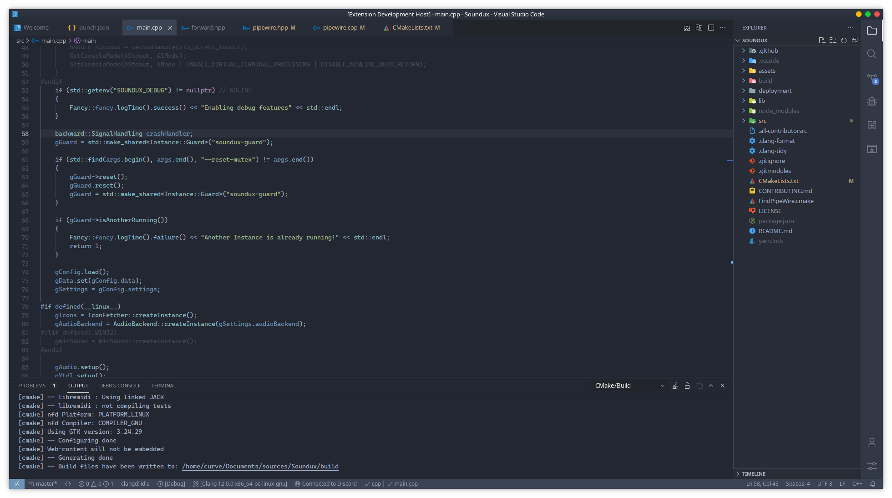
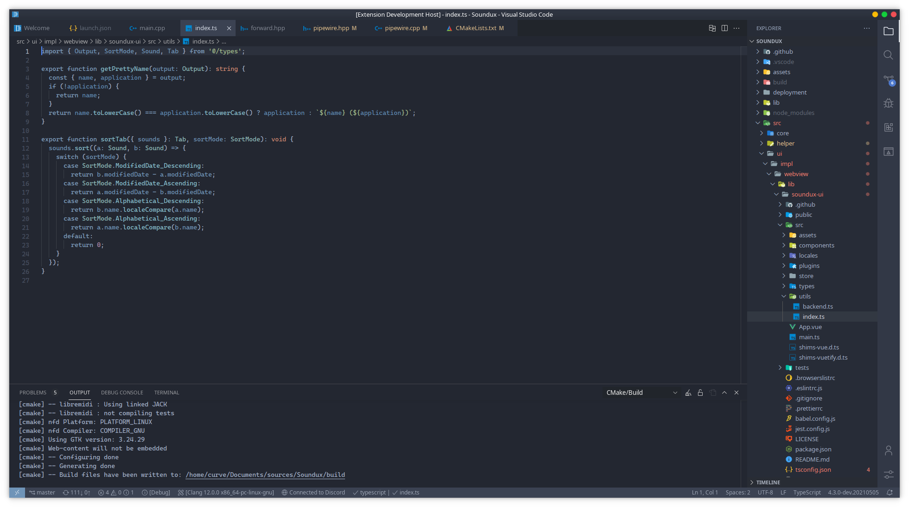

## 🎉 Nord Dark Pro
A Nord theme based on One Dark Pro.

## 👀 Preview

## ✒️ Note

This theme was made with emphasis on C++, the colors for other languages are generated automatically over the base of `One Dark Pro`.

The [base theme file](themes/Nord-Dark-Pro.json) is short, simple and also features descriptions for each `tokenColor` item, so if you wish to modify it you can easily do so without great knowledge!  
> However, the base theme will only work properly for C++ highlighting

If you're done editing the theme you should compile & execute the theme `joiner`.  
There may be conflicts when merging the two themes, you can resolve them yourself in the terminal.  

The current `Full-Theme` has the following conflicts resolved with:
- `#abb2bf` with `#81A1C1`
- `#c678dd` with `#8FBCBB`
- `#e5c07b` with `#6E8DB4`